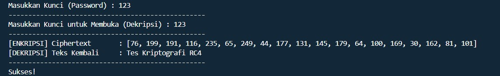
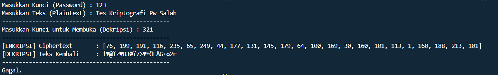

# Implementasi_Kriptografi_MatkulKDI
Tugas Minggu ke - 4 

Penerapan Kriptografi Simmetris Jenis Stream Chiper : RC4 from scratch
-----------------------------------------------------------
By. Firzakarin (24051204017)

RC4 (Stream Chiper) adalah algoritma yang mengenkripsi satu byte pada satu waktu (atau unit yang lebih besar pada satu waktu). 
Dirancang oleh Ronald Rivest dari RSA Security pada tahun 1987, Menurut Rivest, huruf RC merupakan singkatan dari "Ron's Code".

Overview Program :
1. Pembangkitan Kunci
   - Key-Scheduling Algorithm (KSA)
   - Pseudo-Random Generation Algorithm (PRGA)
2. Proses Enkripsi
   - Konversi Karakter
   - Operasi Bitwise
   - Simpan Hasil 
3. Proses Dekripsi
   - Reversibilitas XOR
   - Konversi ASCII

-----------------------------------------------------------
Cara Menjalankan
1. copy git clone https://github.com/Firzakrn/Implementasi_Kriptografi_MatkulKDI
2. paste pada terminal
3. jalankan RC4.py dengan klik kanan run code atau ctrl + alt + N di dalam file

- Contoh Output Sukses : 

- Contoh Output Gagal :

Logika dasar pada proyek ini diadaptasi dan dimodifikasi dari dokumentasi algoritma RC4 oleh GeeksforGeeks 
(Tersedia di: https://www.geeksforgeeks.org/computer-networks/rc4-encryption-algorithm/).
